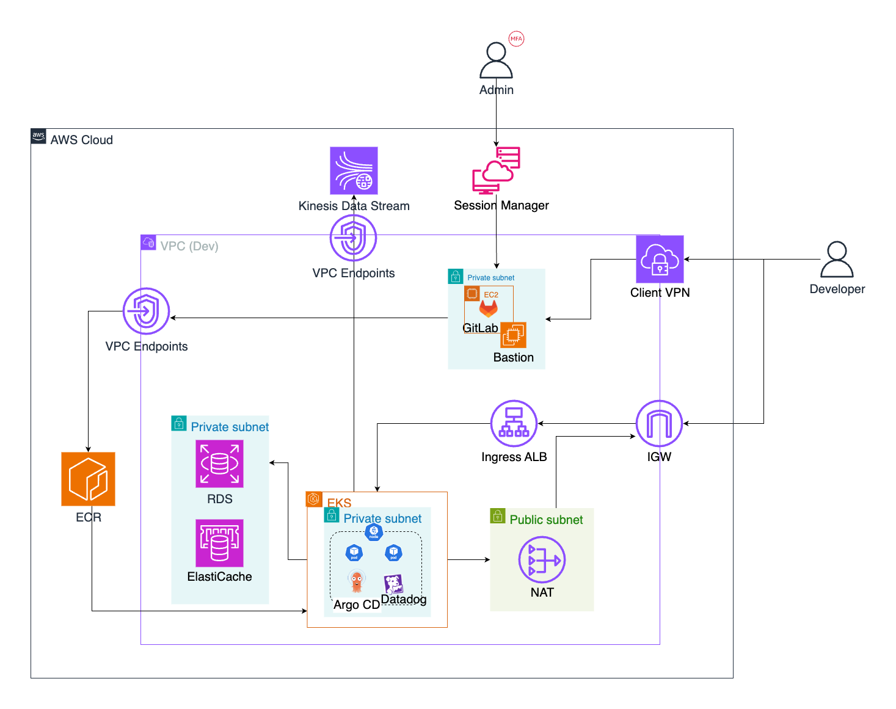

# CGV 영화 예매 시스템 - Backend

1만 동시 접속을 처리하는 실시간 대기열 시스템 (개발계 환경)

## 📋 목차

- [프로젝트 개요](#프로젝트-개요)
- [시스템 아키텍처](#시스템-아키텍처)
- [기술 스택](#기술-스택)
- [대기열 처리 흐름](#대기열-처리-흐름)
- [왜 SQS가 아닌 Kinesis를 선택했나?](#왜-sqs가-아닌-kinesis를-선택했나)
- [핵심 코드 구현](#핵심-코드-구현)
- [트러블슈팅](#트러블슈팅)
- [부하 테스트](#부하-테스트)
- [로컬 개발 환경](#로컬-개발-환경)
- [프로젝트 구조](#프로젝트-구조)
- [배운 점](#배운-점)

---

## 프로젝트 개요

**개발 기간**: 2025.08.11 - 2025.08.29 (3주)  
**팀 구성**: 5명 + 멘토 1명

| 이름 | GitHub | 역할 |
|------|--------|------|
| 정호원 | @ONE0x393 | DevOps, Infra |
| 나영민 | @skdudals99 | DevOps, Infra |
| 이명규 | @lmg5615 | Monitoring, Infra |
| 임세희 | @Sehi55 | Infra, FullStack |
| 홍수빈 | @sss654654 | Infra, FullStack |
| 최중일 | - | 멘토 (CJ 올리브네트웍스) |

**내가 담당한 부분**:
- Spring Boot 백엔드 전체 개발 (대기열 시스템, Kinesis 연동, WebSocket)
- Helm Chart 수정 (팀원이 작성한 기본 템플릿을 내 백엔드에 맞게 환경변수 수정)

## 시스템 아키텍처



### 개발/배포 흐름

```
개발자 (로컬)
    ↓ git push
GitLab (Private Subnet)
    ↓ CI/CD Pipeline
    ├─ Maven Build
    ├─ Docker Build
    └─ ECR Push
        ↓
ArgoCD (EKS 내부)
    ↓ GitOps Sync
EKS Cluster
    └─ Pod 배포/업데이트
```

**접근 방식**:
- Client VPN을 통해 Private Subnet의 GitLab 접근
- GitLab CI/CD가 자동으로 빌드 및 ECR 푸시
- ArgoCD가 변경 감지하여 EKS에 자동 배포

**주요 컴포넌트**:
- **EKS (Fargate)**: Spring Boot 애플리케이션 실행
- **RDS Aurora MySQL**: Writer/Reader 분리, Multi-AZ
- **ElastiCache Redis Serverless**: 대기열 상태 관리 (Sorted Set)
- **Kinesis Data Stream**: 입장 이벤트 스트리밍
- **ALB**: 로드 밸런싱, SSL Termination

## 기술 스택

- Java 17, Spring Boot 3.3.13
- Spring Data JPA, Spring WebSocket (STOMP)
- AWS SDK (Kinesis, RDS, Redis)
- Docker, GitLab CI/CD

## 대기열 처리 흐름

### 사용자 관점

```
1. 예매 버튼 클릭
   ↓
2-A. 활성 세션에 자리 있음 → 즉시 입장 (200 OK)
2-B. 활성 세션 꽉 참 → 대기열 등록 (202 Accepted)
   ↓
3. 대기 페이지에서 실시간 순위 확인 (WebSocket)
   ↓
4. 앞사람 이탈 → 자동 입장 → 좌석 선택 페이지로 이동
```

**처리 방식**:
- Pod를 사람으로 간주하는 방식으로 코드 수정
- 예: Pod당 세션 500개면, 500명을 담는 Pod 1개를 "1명"으로 계산
- 10,000명 테스트 시 10,000개 요청이 아닌 Pod 단위로 카운팅하여 효율적으로 처리

### 백엔드 처리 과정

```
[사용자 요청]
     ↓
[AdmissionService]
  - 활성 세션 체크
  - Redis에 대기열 등록 (Sorted Set)
     ↓
[QueueProcessor - 스케줄러]
  - 2초마다 실행
  - 활성 세션 빈자리 확인
  - 대기열에서 사용자 추출
     ↓
[KinesisProducer]
  - 입장 이벤트 발행
  - Partition Key로 Shard 분산
     ↓
[Kinesis Data Stream]
  - 이벤트 저장 (Shard 분산)
     ↓
[KinesisConsumer]
  - 이벤트 수신
  - WebSocket으로 입장 알림 전송
     ↓
[프론트엔드]
  - 좌석 선택 페이지로 자동 이동
```

## 왜 SQS가 아닌 Kinesis를 선택했나?

처음에는 SQS FIFO + Lambda로 서버리스 아키텍처를 구상.

### SQS 방식의 문제점

1. **실시간 순위 조회 불가능**
   - SQS는 메시지를 저장만 할 뿐, "내가 몇 번째인지" 알 수 없음
   - 별도로 DynamoDB나 Redis를 추가해야 함

2. **아키텍처 파편화**
   - Lambda, Step Functions, EventBridge 등 여러 서비스 조립 필요
   - 대기열 로직이 인프라 설정 곳곳에 흩어짐
   - 전체 흐름 파악과 디버깅이 어려움

3. **Lambda 15분 제한**
   - 사용자 대기 시간이 15분 이상이면 Step Functions 추가 필요
   - 복잡도 증가

### Kinesis + Redis 선택 이유

1. **Redis Sorted Set으로 실시간 순위 조회**
```java
// O(log N) 시간 복잡도로 즉시 순위 확인
Long rank = redisTemplate.opsForZSet().rank("queue:" + movieId, requestId);
```

2. **대기열 로직이 Spring Boot 코드 한 곳에 응집**
   - QueueProcessor, SessionTimeoutProcessor 등 모든 로직이 한 프로젝트에 존재
   - 코드 추적과 디버깅이 쉬움

3. **Kinesis의 강력한 기능**
   - 순서 보장 (Partition Key)
   - Fan-out (여러 Consumer가 동일 이벤트 독립적으로 처리)
   - Replayability (과거 이벤트 재처리 가능)

## 핵심 코드 구현

### 1. Redis 대기열 등록

```java
@Service
public class AdmissionService {
    
    // 대기열 등록
    public void joinQueue(String movieId, String requestId) {
        String queueKey = "waiting_queue:movie:" + movieId;
        
        // Sorted Set에 추가 (score는 현재 시간)
        redisTemplate.opsForZSet().add(queueKey, requestId, System.currentTimeMillis());
    }
    
    // 실시간 순위 조회
    public Long getQueueRank(String movieId, String requestId) {
        String queueKey = "waiting_queue:movie:" + movieId;
        return redisTemplate.opsForZSet().rank(queueKey, requestId);
    }
}
```

**이 코드가 하는 일**:
- 사용자가 대기열에 진입하면 Redis Sorted Set에 저장
- Score(점수)는 현재 시간(타임스탬프)으로 설정하여 선착순 보장
- `ZRANK` 명령어로 O(log N) 시간에 실시간 순위 조회

**Redis Sorted Set을 선택한 이유**:
- 자동 정렬 (타임스탬프 기준)
- `ZRANK` 명령어로 O(log N) 순위 조회
- `ZRANGE`로 범위 추출 가능

### 2. QueueProcessor - 입장 처리

```java
@Component
public class QueueProcessor {
    
    @Scheduled(fixedDelay = 2000)  // 2초마다 실행
    public void processQueue() {
        // 1. 활성 세션 빈자리 계산
        int availableSlots = calculateAvailableSlots();
        
        if (availableSlots <= 0) return;
        
        // 2. 대기열에서 사용자 추출
        Set<String> admittedUsers = redisTemplate.opsForZSet()
            .range("waiting_queue:movie:" + movieId, 0, availableSlots - 1);
        
        // 3. 활성 세션으로 이동
        for (String requestId : admittedUsers) {
            redisTemplate.opsForSet().add("active_sessions:movie:" + movieId, requestId);
            redisTemplate.opsForZSet().remove("waiting_queue:movie:" + movieId, requestId);
        }
        
        // 4. Kinesis에 입장 이벤트 발행
        kinesisProducer.publishAdmitEvents(admittedUsers, movieId);
    }
}
```

**이 코드가 하는 일**:
- 2초마다 자동으로 실행되는 스케줄러
- 현재 활성 세션 수를 확인하여 빈자리 계산
- 대기열에서 빈자리만큼 사용자를 추출하여 활성 세션으로 이동
- KinesisProducer를 호출하여 입장 이벤트를 Kinesis Stream에 발행

**스케줄러를 사용한 이유**:
- 주기적으로 대기열 상태 체크
- 빈자리 발생 시 즉시 다음 사용자 입장 처리
- Spring의 `@Scheduled`로 간단하게 구현

### 3. Kinesis Producer

```java
@Component
public class KinesisAdmissionProducer {
    
    private final KinesisClient kinesisClient;
    
    public void publishAdmitEvents(Set<String> admittedUsers, String movieId) {
        List<PutRecordsRequestEntry> records = new ArrayList<>();
        
        for (String requestId : admittedUsers) {
            // JSON 페이로드 생성
            Map<String, Object> payload = Map.of(
                "action", "ADMIT",
                "requestId", requestId,
                "movieId", movieId,
                "timestamp", System.currentTimeMillis()
            );
            
            records.add(PutRecordsRequestEntry.builder()
                .data(SdkBytes.fromUtf8String(toJson(payload)))
                .partitionKey(requestId)  // 순서 보장
                .build());
        }
        
        kinesisClient.putRecords(PutRecordsRequest.builder()
            .streamName(streamName)
            .records(records)
            .build());
    }
}
```

**이 코드가 하는 일**:
- 입장 허가된 사용자 정보를 JSON 페이로드 형식으로 변환
- Partition Key를 사용하여 같은 사용자는 항상 같은 Shard로 전송
- 여러 레코드를 배치로 묶어서 Kinesis Stream에 한 번에 전송 (성능 최적화)

**Partition Key의 역할**:
- 같은 requestId는 항상 같은 Shard로 전송
- Shard 내에서 순서 보장

### 4. Kinesis Consumer

```java
@Component
public class KinesisAdmissionConsumer {
    
    @Scheduled(fixedDelay = 1000)
    public void consumeEvents() {
        GetRecordsResponse response = kinesisClient.getRecords(
            GetRecordsRequest.builder()
                .shardIterator(shardIterator)
                .limit(100)
                .build()
        );
        
        for (Record record : response.records()) {
            processAdmitEvent(record);
        }
        
        // 다음 읽기를 위해 Iterator 업데이트
        shardIterator = response.nextShardIterator();
    }
    
    private void processAdmitEvent(Record record) {
        Map<String, Object> data = parseJson(record.data());
        String requestId = (String) data.get("requestId");
        
        // WebSocket으로 입장 알림 전송
        messagingTemplate.convertAndSend(
            "/topic/admission/" + requestId,
            Map.of("action", "ADMIT", "message", "입장 가능합니다")
        );
    }
}
```

**이 코드가 하는 일**:
- 1초마다 Kinesis Stream에서 새로운 이벤트를 읽어옴 (최대 100개씩)
- 각 이벤트를 JSON에서 파싱하여 requestId 추출
- WebSocket STOMP를 통해 해당 사용자에게만 입장 알림 전송
- Shard Iterator를 업데이트하여 다음 읽기 위치 저장

**Shard Iterator 방식**:
- 각 Consumer가 독립적으로 읽기 위치 관리
- 여러 Pod가 동시에 같은 이벤트 처리 가능 (Fan-out)

### 5. RDS Aurora Writer/Reader 분리

```java
@Configuration
public class DataSourceConfig {
    
    @Bean
    public DataSource routingDataSource() {
        ReplicationRoutingDataSource routingDataSource = new ReplicationRoutingDataSource();
        
        Map<Object, Object> dataSourceMap = new HashMap<>();
        dataSourceMap.put("write", writeDataSource());
        dataSourceMap.put("read", readDataSource());
        
        routingDataSource.setTargetDataSources(dataSourceMap);
        routingDataSource.setDefaultTargetDataSource(writeDataSource());
        
        return routingDataSource;
    }
}

public class ReplicationRoutingDataSource extends AbstractRoutingDataSource {
    
    @Override
    protected Object determineCurrentLookupKey() {
        // 읽기 전용 트랜잭션이면 Reader, 아니면 Writer
        return TransactionSynchronizationManager.isCurrentTransactionReadOnly() 
            ? "read" : "write";
    }
}
```

**이 코드가 하는 일**:
- RDS Aurora의 Writer 엔드포인트와 Reader 엔드포인트를 각각 DataSource로 등록
- `@Transactional(readOnly=true)` 어노테이션을 감지하여 자동으로 적절한 엔드포인트 선택
- 읽기 전용 쿼리는 Reader로, 쓰기 쿼리는 Writer로 자동 라우팅

**Writer/Reader 분리 이유**:
- **성능 향상**: 읽기 부하를 Reader 인스턴스로 분산하여 Writer 부담 감소
- **확장성**: Reader는 최대 15개까지 Auto Scaling 가능
- **가용성**: Writer 장애 시에도 Reader로 읽기 작업 계속 가능
- **비용 효율**: 읽기가 많은 워크로드에서 Writer 스펙을 낮출 수 있음

**사용 예시**:
```java
@Transactional(readOnly = true)  // Reader 엔드포인트 사용
public List<Movie> findAllMovies() {
    return movieRepository.findAll();
}

@Transactional  // Writer 엔드포인트 사용
public void createReservation(Reservation reservation) {
    reservationRepository.save(reservation);
}
```

## 트러블슈팅

### 1. DB 스키마 불일치

**문제**: Pod 로그에 `Unknown column 'age_rating'` 오류 발생

**원인**: JPA Entity에는 `age_rating` 컬럼이 있는데 실제 DB에는 없음

**해결 과정**:

```bash
# 1. EC2에 MySQL 클라이언트 설치 (Amazon Linux 2023)
sudo dnf install mariadb105-server -y

# 2. RDS 접속
mysql -h iamroot-cgv-db-cluster.cluster-xxx.rds.amazonaws.com -P 3306 -u admin -p

# 3. 스키마 확인
USE cgv;
DESCRIBE movies;

# 4. 누락된 컬럼 추가
ALTER TABLE movies ADD COLUMN age_rating VARCHAR(50);

# 5. Pod 재시작
kubectl rollout restart deployment cgv-api-platform -n cgv-api
```

**배운 점**: 운영 환경에서는 Entity와 DB 스키마가 반드시 일치해야 한다. Flyway 같은 마이그레이션 도구를 사용하면 이런 문제를 예방할 수 있다.

### 2. IRSA 권한 문제

**문제**: Pod가 Kinesis 접근 시 `AccessDeniedException` 발생. 로그를 보니 EC2 노드 역할로 접근 시도 중

**원인**: IRSA(IAM Roles for Service Accounts) 설정이 제대로 동작하지 않음

**해결 과정**:

```bash
# 1. 서비스 계정 확인
kubectl describe serviceaccount cgv-api-platform -n cgv-api
# Annotations에 eks.amazonaws.com/role-arn 확인

# 2. Pod 환경 변수 확인
kubectl exec -it <pod-name> -n cgv-api -- env | grep AWS
# AWS_ROLE_ARN, AWS_WEB_IDENTITY_TOKEN_FILE 확인
```

**IAM 역할 신뢰 관계 확인**:
```json
{
  "Version": "2012-10-17",
  "Statement": [{
    "Effect": "Allow",
    "Principal": {
      "Federated": "arn:aws:iam::ACCOUNT_ID:oidc-provider/oidc.eks.REGION.amazonaws.com/id/CLUSTER_ID"
    },
    "Action": "sts:AssumeRoleWithWebIdentity",
    "Condition": {
      "StringEquals": {
        "oidc.eks.REGION.amazonaws.com/id/CLUSTER_ID:sub": 
          "system:serviceaccount:cgv-api:cgv-api-platform"
      }
    }
  }]
}
```

**핵심 문제**: `pom.xml`에 필수 라이브러리 누락

```xml
<!-- Spring Boot가 IRSA 환경 변수를 자동으로 인식하려면 필수 -->
<dependency>
    <groupId>io.awspring.cloud</groupId>
    <artifactId>spring-cloud-aws-starter</artifactId>
</dependency>
```

**Docker 이미지 검증**:
```bash
docker pull <ECR_이미지>
docker run -it --entrypoint /bin/sh <ECR_이미지>
jar -tf app.jar | grep spring-cloud-aws
```

**배운 점**: IRSA는 IAM 역할 ↔ K8s 서비스 계정 ↔ Pod ↔ 애플리케이션 SDK의 모든 연결고리가 완벽해야 동작한다. 특히 Spring Boot에서는 자동 설정 라이브러리가 필수다.

### 3. Redis CROSSSLOT 오류

**문제**: `QueueProcessor`에서 `CROSSSLOT Keys in request don't hash to the same slot` 오류 발생

**원인**: Redis Cluster 환경에서 여러 키를 동시에 조작하려 했는데, 키들이 서로 다른 노드(슬롯)에 저장되어 있음

**문제 코드**:
```java
// 한 번에 여러 키 조작 시도
redisTemplate.opsForZSet().remove("waiting_queue:movie:" + movieId, requestId);
redisTemplate.opsForSet().add("active_sessions:movie:" + movieId, requestId);
redisTemplate.opsForValue().set("active_user_ttl:movie:" + movieId + ":" + requestId, "1");
```

**해결**: 각 키를 개별적으로 순서대로 처리

```java
// 1. 대기열에서 제거
redisTemplate.opsForZSet().remove("waiting_queue:movie:" + movieId, requestId);

// 2. 활성 세션에 추가
redisTemplate.opsForSet().add("active_sessions:movie:" + movieId, requestId);

// 3. TTL 설정
redisTemplate.opsForValue().set(
    "active_user_ttl:movie:" + movieId + ":" + requestId, 
    "1", 
    30, 
    TimeUnit.SECONDS
);
```

**배운 점**: Redis Cluster는 여러 키를 원자적으로 처리하는 데 제약이 있다. 트랜잭션이 필요하면 Lua 스크립트를 사용하거나, 키를 개별적으로 처리해야 한다.

### 4. EKS 서브넷 태그 문제 (ALB 생성 실패)

**문제**: Ingress 생성 후 ALB가 자동으로 생성되지 않음. AWS Load Balancer Controller 로그에서 서브넷을 찾을 수 없다는 오류 발생

**원인**: EKS 클러스터가 사용하는 서브넷에 필수 태그가 누락됨

**필수 태그**:
```
# 모든 서브넷에 필요
kubernetes.io/cluster/<cluster-name> = shared

# Public Subnet (Internet-Facing ALB용)
kubernetes.io/role/elb = 1

# Private Subnet (Internal ALB용)
kubernetes.io/role/internal-elb = 1
```

**해결**:
```bash
# AWS 콘솔에서 서브넷 태그 추가
# 또는 Terraform으로 태그 추가
resource "aws_subnet" "public" {
  tags = {
    "kubernetes.io/cluster/dev-eks-cluster" = "shared"
    "kubernetes.io/role/elb"                 = "1"
  }
}
```

**배운 점**: AWS Load Balancer Controller는 태그를 기반으로 서브넷을 자동 탐색함. 태그가 없으면 ALB를 어디에 생성해야 할지 알 수 없어서 실패함.

### 5. Client VPN 인증서 만료 문제

**문제**: GitLab 접속을 위한 Client VPN 연결 시 `certificate expired` 오류 발생

**원인**: Terraform으로 생성한 자체 서명 인증서의 유효기간이 만료됨

**해결**:
```bash
# 1. 새로운 인증서 생성 (유효기간 10년)
openssl req -x509 -newkey rsa:2048 -keyout server-key.pem \
  -out server-cert.pem -days 3650 -nodes

# 2. AWS Certificate Manager에 업로드
aws acm import-certificate \
  --certificate fileb://server-cert.pem \
  --private-key fileb://server-key.pem

# 3. Client VPN Endpoint 인증서 교체
aws ec2 modify-client-vpn-endpoint \
  --client-vpn-endpoint-id cvpn-endpoint-xxx \
  --server-certificate-arn arn:aws:acm:...
```

**배운 점**: 자체 서명 인증서는 유효기간 관리가 필요함. 운영 환경에서는 Let's Encrypt나 AWS Certificate Manager를 사용하는 것이 좋음.

### 6. ALB 수동 삭제로 인한 Controller 데드락

**문제**: API 서버 접속 시 `CONNECTION_TIMED_OUT` 발생. Ingress는 존재하지만 실제 ALB가 없음

**원인**: 
- AWS 콘솔에서 ALB를 수동으로 삭제함
- AWS Load Balancer Controller가 관련 Security Group을 정리하려 했으나 실패
- Controller가 데드락 상태에 빠져 새로운 ALB를 생성하지 못함

**Controller 로그**:
```
failed to delete securityGroup: timed out waiting for the condition
```

**해결**:
```bash
# 1. Ingress 삭제 시도 (삭제 대기 상태로 멈춤)
kubectl delete ingress cgv-api-platform-ingress -n cgv-api

# 2. Finalizer 강제 제거
kubectl patch ingress cgv-api-platform-ingress -n cgv-api \
  -p '{"metadata":{"finalizers":[]}}' --type=merge

# 3. ArgoCD에서 Sync 실행하여 Ingress 재생성
# Controller가 정상적으로 새 ALB 생성
```

**배운 점**: Kubernetes Controller가 관리하는 AWS 리소스는 절대 AWS 콘솔에서 수동으로 삭제하면 안 됨. Controller가 데드락에 빠질 수 있음.

## 부하 테스트

### 점진적 테스트 과정

처음부터 10만 명을 테스트한 것이 아니라, 단계적으로 설정값을 조정하면서 시스템 한계를 파악함.

**1단계: 100명 테스트**
```yaml
baseSessionsPerPod: 20
minReplicas: 2
maxReplicas: 5
Redis: 기본 설정
Kinesis: 1 Shard
```
- 목적: 기본 동작 검증
- 결과: 정상 동작 확인

**2단계: 1,000명 테스트**
```yaml
baseSessionsPerPod: 50
minReplicas: 4
maxReplicas: 10
Redis: Connection Pool 10 → 20
Kinesis: 1 Shard
```
- 목적: HPA 동작 확인
- 결과: Pod 자동 확장 확인, 대기열 처리 속도 측정

**3단계: 10,000명 테스트**
```yaml
baseSessionsPerPod: 500
minReplicas: 10
maxReplicas: 100
Redis: Connection Pool 20, Timeout 5초
Kinesis: 2 Shards
```
- 목적: 대규모 트래픽 처리 검증
- 결과: CPU 60%, Memory 75% 유지, 안정적 처리

**핵심 개선사항**:
- Pod를 사람으로 간주하는 방식으로 코드 수정
- 예: Pod당 세션 500개면, 500명을 담는 Pod 1개를 "1명"으로 계산
- 10,000명 테스트 시 10,000개 요청이 아닌 Pod 단위로 카운팅하여 효율적으로 처리

### 테스트 환경

**최종 설정** (values-dev.yaml):
```yaml
replicaCount: 10

resources:
  requests:
    cpu: 800m
    memory: 1500Mi
  limits:
    cpu: 1500m
    memory: 3Gi

config:
  baseSessionsPerPod: "500"
  maxTotalSessions: "200000"
  sessionTimeoutSeconds: "13"

hpa:
  enabled: true
  minReplicas: 10
  maxReplicas: 100
  targetCPUUtilizationPercentage: 60
  targetMemoryUtilizationPercentage: 75
```

### 테스트 스크립트

부하 테스트를 위해 Bash Shell Script를 작성하여 실행:

**test.sh** - 점진적 트래픽 테스트
- `curl` 명령어로 API 호출
- 쿠키 기반 세션 유지 (`-c`, `-b` 옵션)
- 병렬 처리를 위한 백그라운드 실행 (`&`)
- 50개씩 배치로 나누어 부하 분산 (`wait` 명령어)

**test2.sh** - 대규모 트래픽 테스트
- 10,000개 요청을 1,000개 배치로 분할
- `xargs`와 `parallel` 명령어로 동시 실행
- 각 요청마다 고유한 `requestId` 생성 (`uuidgen`)
- 응답 시간 측정 및 로그 저장

### 실행 방법

```bash
# 100명 테스트
./test.sh 100

# 1,000명 테스트
./test.sh 1000

# 10,000명 테스트
./test2.sh
```

### 왜 10,000명까지만 테스트했는가?

**개발계 환경의 한계**:
- 나는 **개발계 담당**으로, 개발계는 기능 검증이 목적
- 운영계보다 낮은 스펙으로 구성 (비용 절감)
  - EKS Node: t3.medium (2 vCPU, 4GB RAM)
  - RDS: db.t3.medium (2 vCPU, 4GB RAM)
  - Redis: 최소 용량 설정
- **10만 명 트래픽은 개발계 리소스로는 무리**
- 대기열 시스템이 정상 동작하는지만 확인하면 충분

**운영계에서는**:
- 고성능 인스턴스 (t3.xlarge, db.r6g.2xlarge)
- HPA 최대 100개 Pod
- Kinesis 100 Shard
- 이 설정으로 10만 명 처리 가능

### 테스트 결과

- **동시 접속**: 10,000명 처리 성공
- **응답 시간**: 평균 200ms 이하
- **HPA 동작**: Pod 10개 → 20개 자동 확장 (개발계 제한)
- **시스템 안정성**: CPU 60%, Memory 75% 이하 유지
- **대기열 처리 속도**: 초당 약 1,000명 입장 처리

**주요 지표**:
- 대기열 → 활성 세션 전환 시간: 평균 10초
- WebSocket 실시간 순위 업데이트: 4-5초 간격
- Redis 응답 시간: 평균 5ms 이하
- Kinesis 이벤트 전달: 평균 100ms 이하

**테스트 동영상**:


> 📹 **10,000명 트래픽 처리 실제 동작**
> 
> - 초기 Pod 10개 (Pod당 500 활성 세션 = 총 5,000명 수용)
> - 5,000명까지 즉시 입장, 5,001명부터 대기열 진입
> - 실시간 순위 업데이트 및 자동 입장 처리
> - QueueProcessor가 2초마다 대기열 처리

## 로컬 개발 환경

### 환경 구분 전략

프로젝트는 **로컬 개발 환경**과 **AWS 운영 환경**을 명확히 분리하여 개발했음.

#### 1. Spring Profile 기반 환경 분리

**application.yml**에서 `local`과 `prod` 프로파일로 구분:

```yaml
# 기본 프로필 (local)
spring:
  profiles:
    active: local
  datasource:
    write:
      jdbc-url: jdbc:mysql://${WRITE_URL:localhost}:${WRITE_PORT:3306}/${DB:cgv}
  data:
    redis:
      host: ${REDIS_HOST:localhost}
      ssl:
        enabled: false  # 로컬에서는 SSL 비활성화

---
# 운영 프로필 (prod)
spring:
  config:
    activate:
      on-profile: prod
  datasource:
    write:
      hikari:
        maximum-pool-size: 20  # 로컬보다 커넥션 풀 확장
  data:
    redis:
      host: ${REDIS_HOST:prod-cgv-redis-cluster.serverless.apn2.cache.amazonaws.com}
      ssl:
        enabled: true  # 운영에서는 SSL 활성화
```

#### 2. 환경 변수 파일 분리

**로컬 개발용** (`.env.local`):
```bash
# 로컬 Docker Compose 환경
WRITE_URL=mysql
READ_URL=mysql
REDIS_HOST=localhost
REDIS_SSL_ENABLED=false
KINESIS_STREAM_NAME=local-stream  # LocalStack 사용
```

**AWS 운영용** (`.env.example`):
```bash
# AWS RDS Aurora, ElastiCache, Kinesis
WRITE_URL=database-1.cluster-cfucw40ewjht.ap-northeast-2.rds.amazonaws.com
READ_URL=database-1.cluster-ro-cfucw40ewjht.ap-northeast-2.rds.amazonaws.com
REDIS_HOST=cgv-redis-cluster-gfbhur.serverless.apn2.cache.amazonaws.com
REDIS_SSL_ENABLED=true
KINESIS_STREAM_NAME=cgv-admissions-stream
```

#### 3. Docker Compose로 로컬 인프라 구성

**docker-compose.yml**:
```yaml
services:
  mysql:
    image: mysql:8.0
    ports:
      - "3307:3306"  # 로컬 MySQL과 충돌 방지
    environment:
      MYSQL_DATABASE: cgv
      MYSQL_USER: cgv_user
      MYSQL_PASSWORD: cgv_password

  redis:
    image: redis:7-alpine
    ports:
      - "6379:6379"

  localstack:
    image: localstack/localstack:latest
    ports:
      - "4566:4566"
    environment:
      - SERVICES=kinesis,sts  # Kinesis 로컬 에뮬레이션
```

**핵심 포인트**:
- **로컬**: Docker Compose로 MySQL, Redis, LocalStack(Kinesis 에뮬레이션) 실행
- **AWS**: RDS Aurora, ElastiCache Serverless, Kinesis Data Stream 사용
- **마이그레이션**: 환경 변수만 변경하면 코드 수정 없이 AWS로 전환 가능

### 로컬 실행 방법

```bash
# 1. 로컬 인프라 실행 (MySQL, Redis, LocalStack)
docker-compose up -d

# 2. Spring Boot 실행 (local 프로파일 자동 활성화)
./mvnw spring-boot:run

# 3. API 테스트
curl http://localhost:8080/api/movies
```

**로컬 환경 특징**:
- SSL 비활성화 (개발 편의성)
- 커넥션 풀 최소화 (리소스 절약)
- SQL 로그 활성화 (디버깅 용이)
- LocalStack으로 Kinesis 비용 없이 테스트

## 프로젝트 구조

```
dev_backend/
├── src/main/java/com/example/
│   ├── admission/              # 대기열 시스템
│   │   ├── KinesisAdmissionProducer.java
│   │   ├── KinesisAdmissionConsumer.java
│   │   ├── QueueProcessor.java
│   │   └── SessionTimeoutProcessor.java
│   ├── config/
│   │   ├── AwsConfig.java
│   │   ├── RedisConfig.java
│   │   ├── DataSourceConfig.java
│   │   └── WebSocketConfig.java
│   ├── movie/
│   ├── session/
│   └── websockets/
├── src/main/resources/
│   ├── application.yml
│   └── db/migration/
├── docker-compose.yml
├── Dockerfile
├── test.sh
└── test2.sh
```

## 배운 점

- 대규모 트래픽 처리를 위한 아키텍처 설계 경험
- Redis Sorted Set을 활용한 실시간 순위 조회 구현
- Kinesis를 통한 이벤트 기반 시스템 설계
- RDS Aurora Writer/Reader 분리로 읽기 성능 향상
- IRSA를 통한 EKS Pod IAM 권한 관리
- 실전 트러블슈팅 경험 (DB 스키마, IRSA, Redis Cluster, ALB Controller)
- 점진적 부하 테스트를 통한 시스템 한계 파악 및 최적화
- AWS 리소스 태그 관리의 중요성
- Kubernetes Controller가 관리하는 리소스는 수동 조작 금지
